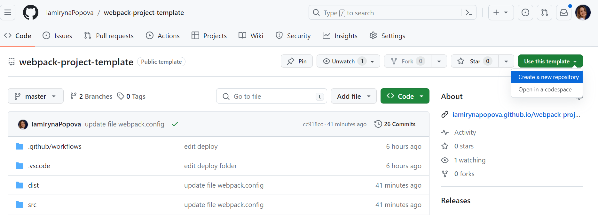
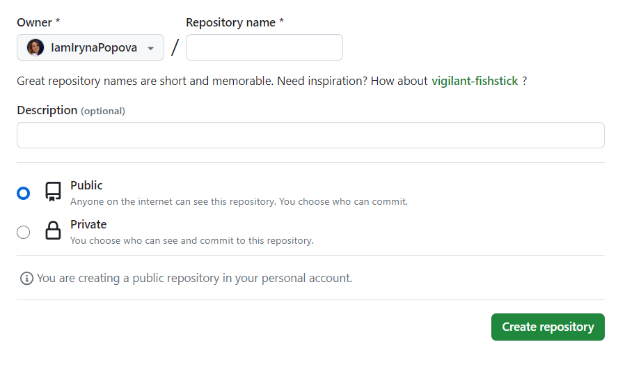
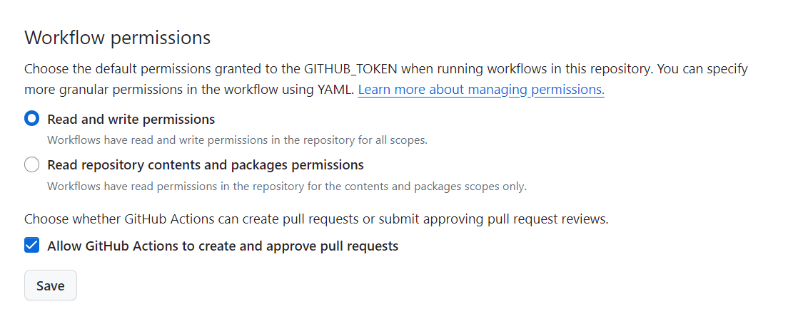
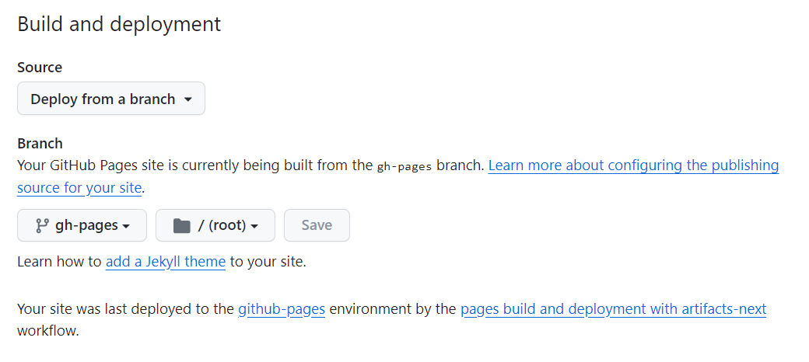
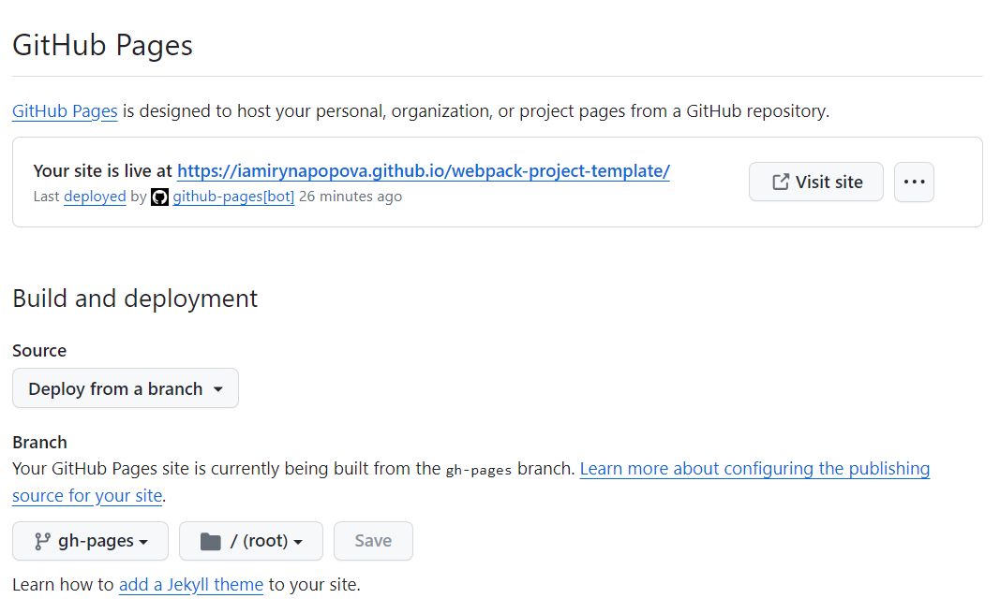

# Webpack-project-template

 [Документація](https://webpack.js.org/)

## Початок нового проєкту

Використай цей шаблон, натиснув `«Use this template»` и вибери опцію
`«Create a new repository»`, як показано на зображенні.



На наступному етапі відкриється сторінка створення нового репозиторію. Заповни поле ім'я і натисни кнопку
`«Create repository»`.



Після створення репозиторію, потрібно перейти в `Settings` > `Actions` > `General` 

В секції `«Workflow permissions»` вибери опцію `«Read and write permissions»` і постав галочку в чекбоксі та натисни `Save`. Це потрібно для автоматичного деплою проєкту.




## Деплой

Продакшен версія буде автоматично збиратись і деплоїтись на GitHub Pages, в гілку `gh-pages` кожен раз, коли оновлюється `master`. 
Для цього необхідно:
1. Клонуй новий репозиторій на ПК командою
` git clone https://your_username.github.io/your_repo_name/ `
2. в файлі `package.json` відредагувати поле `homepage`, замінив
`your_username` и `your_repo_name` на свої, і відправити зміни на GitHub.

```json
"homepage": "https://your_username.github.io/your_repo_name/"
```
3. заходимо в налаштування GitHub-репозиторію (`Settings` > `Pages`) і вибираємо роздачу продакшн версії файлів з папки `/root` гілки `gh-pages`, якщо це не створилось автоматично і натискаємо `Save`



Через кілька хвилин, живу сторінку можна буде подивитися
за адресою вказаною у відредагованій властивості `homepage`.



Якщо відкриється порожня сторінка, переконайтеся, що у вкладці `Console` немає помилок
пов'язаних з неправильними шляхами до CSS та JS файлів проекту (**404**). Швидше
всього в тебе неправильне значення властивості `homepage` у файлі `package.json`.

## Статус деплою

Статус відображається біля останнього коміту 

- **Жовтий колір**  - виконується збірка і деплой проєкту.
- **Зелений колір** - деплой завершився успішно.
- **Червоний колір** - сталася помилка.

Детальніше про статус тут 👉 `Details`.

## Початок рoботи
 1. Перевір, щоб на твоєму ПК була встановлена LTS-версія Node.js.
   [Скачай і встанови](https://nodejs.org/en/) ,якщо необхідно.
 2. Встанови базові залежності проєкту - команда `npm install`.
 3. Запусти режим розробки -`npm start`.
 4. Перейди в браузер за адресою [http://localhost:3000](http://localhost:3000).
 Ця сторінка буде автоматично перезавантажуватись при внесенні змін
 5. Збірка проєкту виконується командою -`npm run build`.


